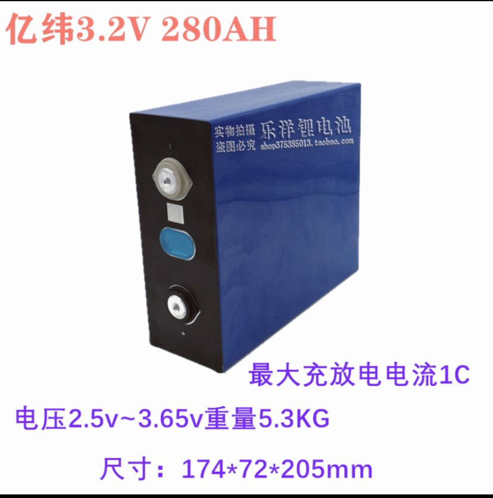
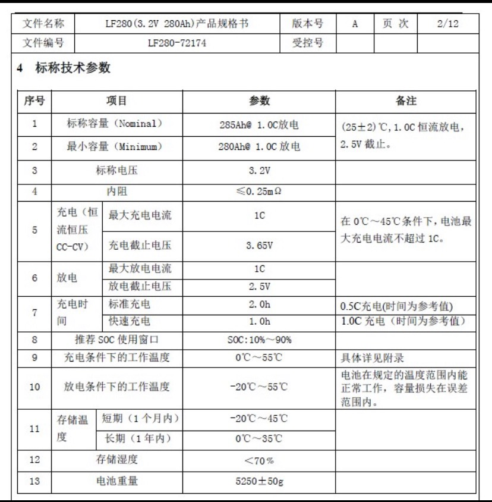
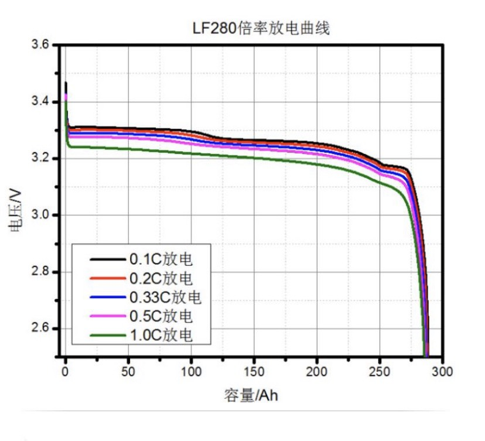
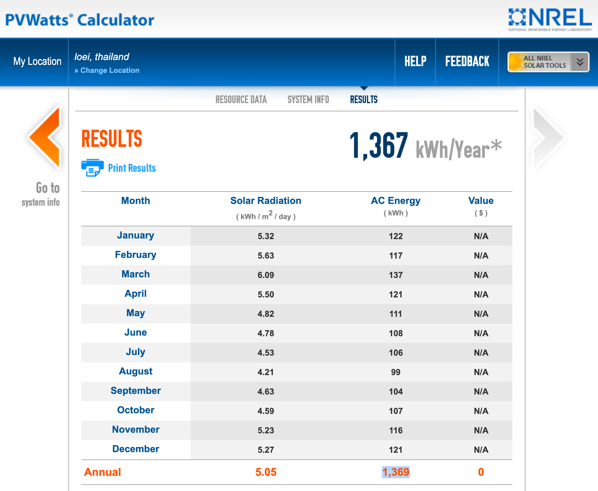
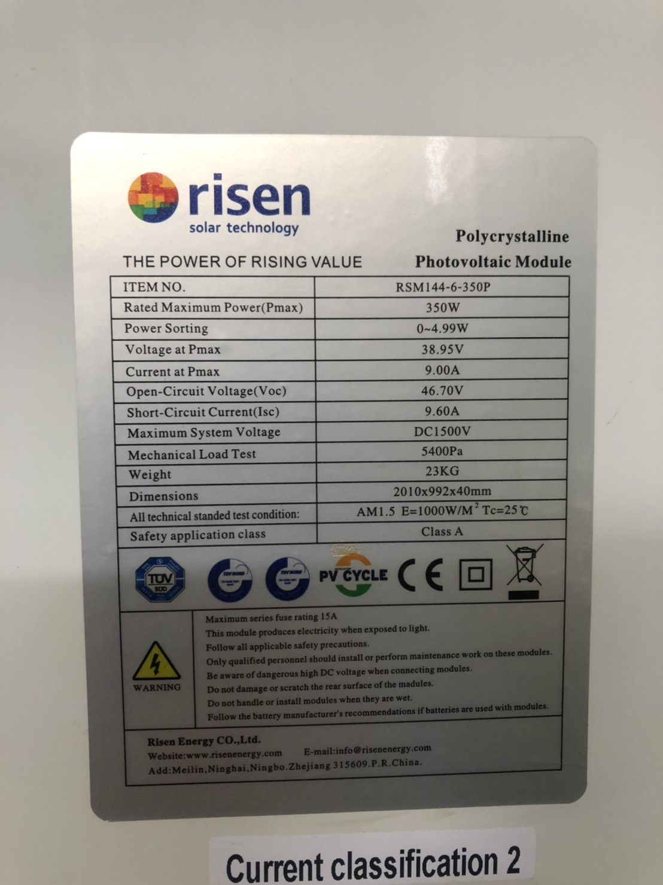
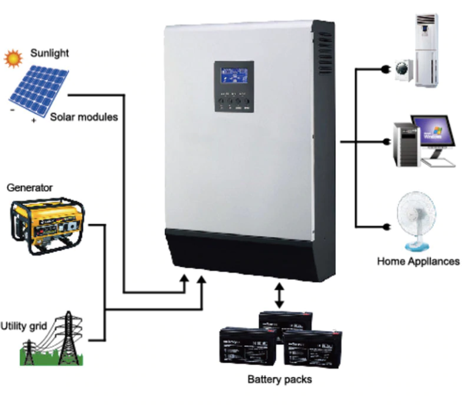
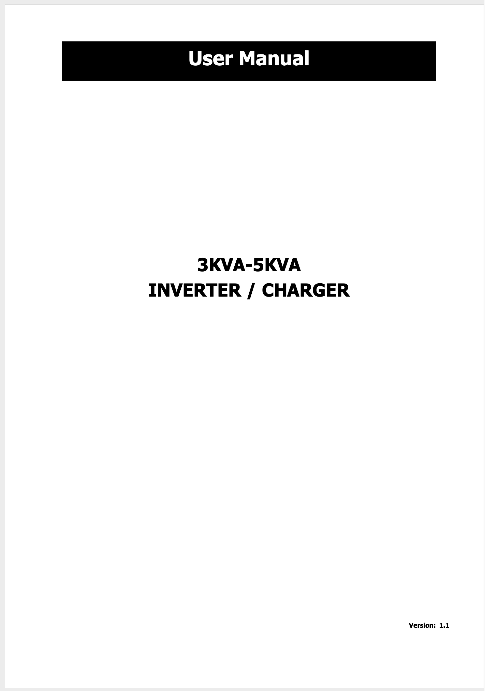

# Design & Integration & Installation of a 5-kW Rooftop Solar PV System

On this page, let us discuss how we can design a completely off-grid 5-kW rooftop solar PV system. 

## 1.0 Determine Load

First, we need to know what loads we are going to use. In our scenario, we will create a rooftop system that can serve three houses. All three houses have the appliances as listed in the table below.

|                 | Load  (Watt) | Quantity | Total Load  (Watt) | Usage hours  (Hrs/day) | Watt*Hour |
|-----------------|:------------:|:--------:|:------------------:|:----------------------:|-----------|
| Fan             |      50W     |     3    |        150W        |            3           |    450    |
| Exhaust fan     |      30W     |     9    |        270W        |            1           |    270    |
| Light           |      12W     |    33    |        396W        |            4           |   1,584   |
| Fridge          |     150W     |     3    |        450W        |           10           |   4,500   |
| EV              |    1,500W    |     1    |       1,500W       |            3           |   4,500   |
| Pump            |     150W     |     1    |        150W        |            2           |    300    |
| Washing machine |     350W     |     3    |       1,050W       |           1.5          |   1,575   |
| Blender         |     600W     |     1    |        600W        |          0.01          |     6     |
| Rice cooker     |     600W     |     1    |        600W        |          0.02          |     12    |
| Total           |              |          |     **4,566W**     |                        | **13,185Wh**  |

From the table, we can see that the total load if all appliances are used at the same time is 4,566W. This implies that **we should at least size our solar panel to cover this amount, i.e., 4,566W**.

Also, the total Wh is 13,185Wh. Hence, **our battery size should be at least 13,185 /0.8 (assuming 80% depth of discharge) /0.95 (assuming 95% inverter efficiency) = 17,349 Wh.** 

## 2.0 Decide on the System Voltage

Typically, for a system with load between 1 and 5 kWh, we can use a 24V system. In this case, the load is >5kWh. Hence, our system is designed as a 48V system.

## 3.0 Size the Battery 

We decided to use LiFePo4 (Lithium Iron Phosphate) battery. At the time of desining this PV system, LiFePo4 battery sizes in the market are: 105Ah, 120Ah, 200Ah and 280Ah. Each battery voltage is around 3.2V. Hence we need to use 16 LiFePo4 cells for a 48V system.

* 1 string of 280Ah battery = 280Ah * 48V = 13,440 Wh
* 2 string of 280Ah battery = 280Ah * 48V * 2 = 26,880 Wh

If our load draws 13,185 Wh of energy each day, this is equivalent to battery depth of discharge (DoD) of (13,185/0.95)/26,880 = 51%. Hence, this battery size, i.e., two strings of 280Ah battery at 48V, is sufficient to power the above load each night, and still the battery DoD is around 50%. This may seem to oversize the battery (as we will not charge EV over night), but it is better to have low DoD to maintain long battery life.

Below is the spec of the LiFePo4 battery we chose.

## 4.0 Size PV Panels

Based on PVWatt website (https://pvwatts.nrel.gov/), for our location, daily electricity generation from a 1kW PV unit is 3.75kWh (i.e., 1,369kWh per year/365days).  

This means we could expect full sunshine for 3.75 hours each day. To fully charge our battery each day, we need to have **17,349kWh/3.75hr = 4,626kW of solar PV**. 

Hence, we decided to use 14 panels of polycrystalline solar PV at 350W each, which is equivalent to **350W * 14 = 4,900W.** Below is the spec of the solar panel we chose. 

## 5.0 Size the Inverter

We would like to use a hybrid inverter. The benefit of the hybrid inverter is that it can use electricity generated from solar PV to power the load without going through battery. The concept of the hybrid inverter is shown below.

We decided to use 5kVA inverter (and we need to make sure that we are not going exceed 2000W of power drawn at a time). Note: Although the inverter spec said it is 5kW, but to be on a safe side, we should not use more than half of its rating to prevent inverter damage.  Here is the spec of the inverter we chose.

## 6.0 Installation

Now it is our fun part to acquire all components & install the system.  Below is the list of all system components and the purchased price (as of 2020). The total equipment cost is estimated at 160,000 Thai Baht.

|                                                | Unit Price  (Baht) | Quantity | Total Price   (Baht) |
|------------------------------------------------|:------------------:|:--------:|:--------------------:|
| Solar Panel (polycrystalline, half cell, 350W) |        3,000       |    14    |        42,000        |
| 5000W Inverter                                 |       15,500       |     1    |        15,500        |
| Battery (280AH, LiFePO4)                       |        2,850       |    32    |        91,200        |
| BMS (150A, 48V)                                |        2,700       |     2    |         5,400        |
| Active Balancer (5A)                           |        1,700       |     2    |         3,400        |
| Busbar (50cm)                                  |         180        |     6    |         1,080        |
| Screw M6                                       |         50         |     7    |          350         |
| Solar cable 4 sqmm                             |         17         |    50    |          850         |
| DC surge arrester (420V, 30kA)                 |         195        |     1    |          195         |
| AC surge arrester (SPD 20kA 500V/1000V)        |         275        |     1    |          275         |
| Ground rod (1 meter)                           |         130        |     1    |          130         |
| หางปลา SV 1.25-6                               |         25         |     1    |          25          |
| เทปใยสัปปะรด                                    |         200        |     1    |          200         |

Then, we can decide the size of each component, i.e., solar panels, battery units and the inverter. It is then the time that we put everything together (integration phase)

